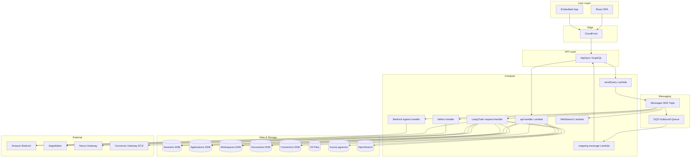
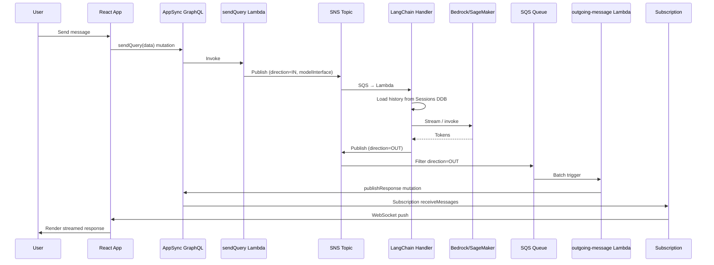

# 01-end-to-end-overview.md

## Repository Layout

| Root Folder | Role |
|-------------|------|
| `bin/` | CDK app entry (`aws-genai-llm-chatbot.ts`), `config.ts`, `config.json` / `default-config.json` |
| `lib/` | CDK constructs and app code: `aws-genai-llm-chatbot-stack.ts`, `authentication/`, `chatbot-api/`, `connectors/`, `model-interfaces/`, `models/`, `monitoring/`, `rag-engines/`, `shared/`, `user-interface/`, `utils.ts` |
| `cli/` | CLI (`magic.ts`, `magic-config.ts`) for interactive config |
| `tests/` | Jest (TS) and pytest unit tests |
| `integtests/` | Integration tests (Python, optional Selenium) |
| `docs/` | VitePress docs; `guide/`, `documentation/`, `about/` |
| `scripts/` | Shell scripts (e.g. vend-prep) |
| `aws-genai-llm-chatbot/` | SeedFarmer module definitions, `capability.yaml`, `deployment.yaml` |
| `.github/workflows/` | CI: `build.yaml`, `deploy.yml` (docs), `e2e-validation.yml` |
| `.devcontainer/` | Dev container config for Codespaces/local |

**Build tools:** npm (root + `lib/user-interface/react-app`), Hatch (Python via `pyproject.toml`). **Monorepo:** Single repo; frontend in `lib/user-interface/react-app`, backend Lambdas in `lib/` subfolders.

---

## Executive Summary

The **AWS GenAI LLM Chatbot** is an enterprise-ready generative AI solution with Retrieval Augmented Generation (RAG) capabilities. Organizations deploy it to provide secure, context-aware chatbot experiences powered by LLMs (Bedrock, SageMaker, Nexus Gateway) with document ingestion, multi-modal input, and role-based access.

**Users:**
- **End users**: Chat via embedded applications or playground (authenticated via Cognito)
- **Admins / Workspace managers**: Manage workspaces, RAG data sources, models, applications, connectors

**Key value:**
- Multi-provider LLM support (Bedrock, SageMaker, Nexus)
- RAG: Aurora pgvector, OpenSearch Serverless, Kendra, Bedrock Knowledge Base
- Real-time streaming via AppSync GraphQL subscriptions
- Connectors (MCP): Azure SQL, SharePoint, Dropbox; ECS-based Connector Gateway
- **Intent detection**: Classifies user queries (e.g. general, resume assessment, job posting creation) to route to appropriate prompt templates and RAG flows
- **Configurable prompt templates**: Per-application system prompts and intent-specific prompts to improve response quality across all models

---

## Architecture Overview

---

## Major Components

| Component | Technology | Key Files |
|-----------|------------|-----------|
| **Frontend** | React 18, Vite, Cloudscape Design, AWS Amplify | `lib/user-interface/react-app/`, `lib/user-interface/index.ts` |
| **API** | AppSync GraphQL (USER_POOL + IAM), WAF | `lib/chatbot-api/`, `lib/chatbot-api/schema/schema.graphql` |
| **Auth** | Amazon Cognito (email, OIDC/SAML federation) | `lib/authentication/index.ts` |
| **Chat backend** | SNS message bus → SQS → LangChain/Bedrock/Idefics/WebSearch Lambdas | `lib/model-interfaces/langchain/`, `lib/chatbot-api/websocket-api.ts` |
| **RAG** | Aurora pgvector, OpenSearch, Kendra, Bedrock KB; Step Functions for workspace/doc lifecycle | `lib/rag-engines/` |
| **Connectors** | DynamoDB, Connector Gateway (ECS Fargate), MCP integration | `lib/connectors/`, `lib/shared/layers/python-sdk/python/genai_core/connectors/` |
| **Storage** | DynamoDB, S3, Aurora, OpenSearch Serverless | `lib/chatbot-api/chatbot-dynamodb-tables/`, `lib/rag-engines/rag-dynamodb-tables/` |

---

## End-to-End Request Flow

### Chat Flow (Real-time)

**Files:** `lib/chatbot-api/functions/resolvers/send-query-lambda-resolver/index.py` → `lib/model-interfaces/langchain/functions/request-handler/index.py` → `lib/chatbot-api/functions/outgoing-message-appsync/index.ts`

### RAG Query Flow

1. User sends message with `workspaceId` in Add Data / semantic search or chat
2. api-handler routes to `performSemanticSearch` / RAG-related handlers
3. `genai_core` layer queries workspaces, documents, Aurora/OpenSearch/Kendra
4. For chat+RAG: LangChain request-handler classifies **intent** (general, qa_mode, resume_assessment, job_posting_creation), resolves the appropriate **prompt template** (IntentPrompts → STAFFING_PROMPTS → application system prompts), invokes RAG retrieval (WorkspaceRetriever), then LLM with augmented context

**Files:** `lib/chatbot-api/functions/api-handler/routes/semantic_search.py`, `lib/chatbot-api/functions/api-handler/routes/rag.py`, `lib/model-interfaces/langchain/functions/request-handler/index.py`, `lib/model-interfaces/langchain/functions/request-handler/utils/intent/`, `lib/model-interfaces/langchain/functions/request-handler/utils/prompt_resolver/`

### Connector Flow

1. Admin/workspace_manager creates connector via `createConnector` mutation
2. api-handler stores in Connectors DDB, secrets in Secrets Manager
3. Chat: LangChain handler reads connectors for workspace, calls Connector Gateway (MCP) for context
4. Add Data: `listConnectorFolder` / `ingestFromConnector` → connector file import workflow

**Files:** `lib/chatbot-api/functions/api-handler/routes/connectors.py`, `lib/shared/layers/python-sdk/python/genai_core/connectors/`

### Intent Detection and Prompt Resolution Flow

1. User sends a chat message via an application (optionally with workspace/RAG)
2. LangChain request-handler runs **intent detection** (rule-based or LLM-based when `INTENT_CLASSIFIER_ENABLED=true`)
3. Supported intents: `general`, `qa_mode`, `resume_assessment`, `job_posting_creation`
4. **Prompt resolution** (in order): Application `intentPrompts` (JSON) → built-in `STAFFING_PROMPTS` → application system prompts (System Prompt, System Prompt with workspace, Condense System Prompt)
5. RAG retrieval uses the workspace when applicable; the resolved prompt template is applied to the LLM for higher-quality, context-aware responses across Bedrock, SageMaker, and Nexus models

**Files:** `lib/model-interfaces/langchain/functions/request-handler/utils/intent/`, `lib/model-interfaces/langchain/functions/request-handler/utils/prompt_resolver/`, `lib/model-interfaces/langchain/functions/request-handler/adapters/shared/prompts/staffing_prompts.py`

---

## Data Model (Key Entities)

| Entity | Storage | Key Schema | Created/Updated By |
|--------|---------|------------|--------------------|
| **Session** | DynamoDB (`sessionsTable`) | PK: `SessionId`, SK: `UserId`; GSI: `byUserId` | sendQuery flow (new session on first message); api-handler `deleteSession` |
| **Application** | DynamoDB (`applicationTable`) | PK: `Id`; includes `systemPrompt`, `systemPromptRag`, `condenseSystemPrompt`, `intentPrompts` (JSON) | api-handler `createApplication`, `updateApplication`, `deleteApplication`; LangChain uses for intent-based prompt resolution |
| **Workspace** | DynamoDB (`workspacesTable`) | PK: `workspace_id`, SK: `object_type`; GSI: `by_object_type_idx` | api-handler workspace mutations; Step Functions (Aurora/OpenSearch/Kendra create) |
| **Document** | DynamoDB (`documentsTable`) | PK: `workspace_id`, SK: `document_id`; GSI: `by_compound_key_idx`, `by_status_idx` | File/website/RSS/connector import workflows; api-handler `addTextDocument`, `addWebsite`, etc. |
| **Connector** | DynamoDB (`connectorsTable`) | PK: `connector_id`, SK: `workspace_id`; GSI: `by_workspace` | api-handler `createConnector`, `updateConnector`, `deleteConnector` |
| **User feedback** | S3 (`userFeedbackBucket`) | Key pattern TBD | api-handler `addUserFeedback` |
| **Chat files** | S3 (`filesBucket`) | User uploads for multimodal | Pre-signed URL via `getUploadFileURL`; LangChain/Idefics read |

**Files:** `lib/chatbot-api/chatbot-dynamodb-tables/index.ts`, `lib/chatbot-api/application-dynamodb-tables/index.ts`, `lib/rag-engines/rag-dynamodb-tables/index.ts`, `lib/connectors/connector-dynamodb-tables/index.ts`

---

## Core Constraints and Invariants

- **Auth model**: All GraphQL operations require Cognito USER_POOL auth (except `publishResponse`, IAM). RBAC via `@aws_cognito_user_pools(cognito_groups: ["admin", "workspace_manager"])` in schema. File: `lib/chatbot-api/schema/schema.graphql`
- **Tenant / workspace boundary**: `workspace_id` scopes documents, connectors, semantic search. Sessions scoped by `UserId` (Cognito sub). Files: `lib/chatbot-api/chatbot-dynamodb-tables/index.ts`, `lib/rag-engines/rag-dynamodb-tables/index.ts`
- **Message routing**: SNS filter by `direction` (IN/OUT) and `modelInterface` (langchain, agent, multimodal, websearch). File: `lib/aws-genai-llm-chatbot-stack.ts` (subscriptions)
- **Idempotency**: Session/chat uses sessionId; no explicit idempotency keys on mutations. TBD: retry behavior on `sendQuery` duplicate publish
- **Config source**: Runtime config from SSM Parameter Store (`CONFIG_PARAMETER_NAME`). File: `lib/shared/index.ts`, `lib/chatbot-api/functions/api-handler/`

---

## Key Design Decisions

| Decision | Rationale | Tradeoff |
|----------|-----------|----------|
| SNS as message bus | Decouple sendQuery from model interfaces; fan-out by modelInterface/direction | Extra hop vs direct Lambda invoke; enables multiple consumers (LangChain, Bedrock, Idefics, WebSearch) |
| Single api-handler Lambda | All Query/Mutation resolvers → one Lambda, route by `fieldName` | Simpler deployment; shared cold start; 10 min timeout for long-running RAG/connector ops |
| genai_core Python layer | Shared business logic (workspaces, documents, connectors, embeddings) | Lambda layer packaging; PYTHONPATH `lib/shared/layers/python-sdk/python` |
| Cognito + RBAC | Enterprise SSO via OIDC/SAML; groups for admin/workspace_manager/user | No built-in API-key-only auth for programmatic access; IAM mode exists for publishResponse |
| CDK + config.json | `config.json` / `bin/config.json` drive feature flags (RAG, connectors, Bedrock, Nexus) | Config changes require re-deploy or manual SSM update |
| Intent detection + prompt templates | Classify user queries and apply intent-specific prompts per application; improves response quality across all LLM providers | Rule-based default; LLM classifier optional (Bedrock); Application `intentPrompts` max 16 KB |

---

## Operational Characteristics

- **Scaling**: Serverless (Lambda, AppSync, SQS, SNS); Aurora/OpenSearch/Kendra scale independently
- **Statefulness**: Sessions and Applications in DynamoDB; no sticky sessions
- **Concurrency limits**: WAF rate limit per IP on `SendQuery` (default 100/10 min). File: `lib/chatbot-api/index.ts` (createWafRules)
- **Bottlenecks**: LangChain request-handler 15 min timeout, 1024 MB; SageMaker cold start; Connector Gateway ECS capacity
- **DLQ**: Outgoing SQS has DLQ (maxReceiveCount 3). File: `lib/chatbot-api/websocket-api.ts`
