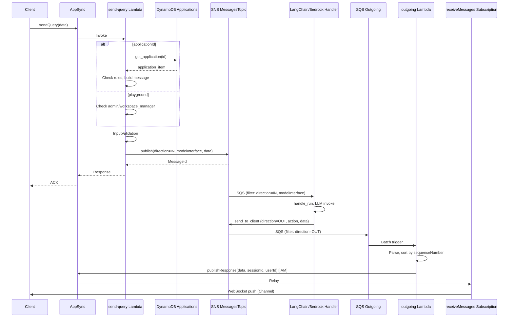
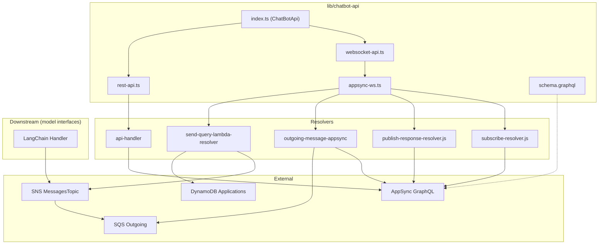

# API Layer: AppSync GraphQL + Realtime, API Handler, SendQuery, Outgoing — Reverse Engineering

**Scope:** `lib/chatbot-api/` (AppSync schema, resolvers, send-query Lambda, api-handler Lambda, outgoing-message Lambda).  
**Evidence:** All findings cite file paths. Only code referenced from this module is included.

---

## 1. Main Classes / Files

### 1.1 CDK Infrastructure & Orchestration

| File | Purpose |
|------|---------|
| `lib/chatbot-api/index.ts` | ChatBotApi construct: creates GraphQL API, ApiResolvers (rest-api), RealtimeGraphqlApiBackend (websocket-api), wires api-handler and realtime resolvers; exports messagesTopic, queue, sessionsTable, etc. |
| `lib/chatbot-api/websocket-api.ts` | RealtimeGraphqlApiBackend: creates SNS messagesTopic, SQS OutgoingMessagesQueue (direction=OUT filter), DLQ, RealtimeResolvers |
| `lib/chatbot-api/appsync-ws.ts` | RealtimeResolvers: send-query Lambda, outgoing-message Lambda, resolvers for sendQuery, publishResponse, receiveMessages |
| `lib/chatbot-api/rest-api.ts` | ApiResolvers: api-handler Lambda, auto-creates resolver per Query/Mutation field (except sendQuery, publishResponse) |

### 1.2 GraphQL Schema

| File | Purpose |
|------|---------|
| `lib/chatbot-api/schema/schema.graphql` | GraphQL schema: sendQuery(data: String), publishResponse(sessionId, userId, data), receiveMessages(sessionId) @aws_subscribe(mutations: ["publishResponse"]); Channel type (data, sessionId, userId); Query/Mutation field definitions |

### 1.3 SendQuery (Realtime Inbound)

| File | Purpose |
|------|---------|
| `lib/chatbot-api/functions/resolvers/send-query-lambda-resolver/index.py` | AppSync sendQuery resolver: parses request JSON, with applicationId loads application from DynamoDB, checks user roles, builds SNS message (direction=IN, action, modelInterface, data), validates with Pydantic, publishes to SNS |
| `lib/chatbot-api/functions/resolvers/send-query-lambda-resolver/applications.py` | get_application(id): DynamoDB get_item on APPLICATIONS_TABLE_NAME |

### 1.4 PublishResponse & Subscription Resolvers (JS)

| File | Purpose |
|------|---------|
| `lib/chatbot-api/functions/resolvers/publish-response-resolver.js` | AppSync publishResponse resolver: passes through arguments as payload (data, sessionId, userId); uses noneDataSource (relay) |
| `lib/chatbot-api/functions/resolvers/subscribe-resolver.js` | AppSync receiveMessages subscription: validates sessionId regex, sets subscription filter (userId eq identity.sub AND sessionId eq args.sessionId) |

### 1.5 Outgoing Message Handler

| File | Purpose |
|------|---------|
| `lib/chatbot-api/functions/outgoing-message-appsync/index.ts` | SQS batch processor: parses SNS message, strips metadata for non-admin/workspace_admin on final_response, builds publishResponse mutation, calls graphQlQuery (AppSync IAM) |
| `lib/chatbot-api/functions/outgoing-message-appsync/graphql.ts` | graphQlQuery(query): signs request with SigV4 (IAM), POSTs to GRAPHQL_ENDPOINT, returns JSON |

### 1.6 API Handler (Non-Realtime Query/Mutation)

| File | Purpose |
|------|---------|
| `lib/chatbot-api/functions/api-handler/index.py` | AppSyncResolver app: routes event by fieldName to included routers; catches ValidationError, CommonError, generic Exception |
| `lib/chatbot-api/functions/api-handler/routes/sessions.py` | getSession, listSessions, deleteSession, deleteUserSessions, getFileURL |
| `lib/chatbot-api/functions/api-handler/routes/applications.py` | getApplication, listApplications, createApplication, updateApplication, deleteApplication |
| `lib/chatbot-api/functions/api-handler/routes/workspaces.py` | listWorkspaces, getWorkspace, create*Workspace, deleteWorkspace |
| `lib/chatbot-api/functions/api-handler/routes/documents.py` | listDocuments, getDocument, addDocument, addRssFeed, etc. |
| `lib/chatbot-api/functions/api-handler/routes/connectors.py` | listConnectors, getConnector, createConnector, updateConnector, deleteConnector, testConnector |
| `lib/chatbot-api/functions/api-handler/routes/rag.py` | RAG-related operations |
| `lib/chatbot-api/functions/api-handler/routes/semantic_search.py` | performSemanticSearch |
| `lib/chatbot-api/functions/api-handler/routes/models.py` | listModels |
| `lib/chatbot-api/functions/api-handler/routes/agents.py` | listAgents |
| `lib/chatbot-api/functions/api-handler/routes/health.py` | checkHealth |
| `lib/chatbot-api/functions/api-handler/routes/embeddings.py` | listEmbeddingModels, calculateEmbeddings |
| `lib/chatbot-api/functions/api-handler/routes/cross_encoders.py` | listCrossEncoders, rankPassages |
| `lib/chatbot-api/functions/api-handler/routes/kendra.py` | listKendraIndexes, isKendraDataSynching |
| `lib/chatbot-api/functions/api-handler/routes/bedrock_kb.py` | listBedrockKnowledgeBases |
| `lib/chatbot-api/functions/api-handler/routes/user_feedback.py` | userFeedback operations |
| `lib/chatbot-api/functions/api-handler/routes/roles.py` | listRoles |
| (etc.) | Additional route modules for all schema fields |

---

## 2. Call Relationships

```
Client
  ├─ sendQuery(data) ────────────────────────────────────────────────────────┐
  │     → AppSync send-message-resolver (Lambda)                               │
  │         → send-query-lambda-resolver/index.py handler                      │
  │             → applications.get_application(id) [if applicationId]        │
  │             → sns.publish(message) ──────────────────────────────────────│──→ SNS MessagesTopic
  │                                                                           │      │
  │     (SNS filter: direction=IN, modelInterface=langchain|agent|idefics)    │      │ (subscriptions to model handlers)
  │     → LangChain/Bedrock/Idefics request-handlers                            │      │
  │         → send_to_client(detail) → sns.publish(direction=OUT) ─────────────│──────┘
  │                                                                           │
  │     (SNS filter: direction=OUT)                                          │
  │     → SQS OutgoingMessagesQueue                                           │
  │         → outgoing-message-appsync handler                                 │
  │             → graphql.ts graphQlQuery(publishResponse mutation)           │
  │             → AppSync publishResponse (IAM)                                │
  │                 → receiveMessages subscription filter (userId, sessionId)  │
  │                                                                           │
  ├─ receiveMessages(sessionId) subscription ──────────────────────────────────┤
  │     → subscribe-resolver.js (filter: userId eq identity.sub, sessionId)    │
  │     → WebSocket push when publishResponse is called                        │
  │                                                                           │
  └─ Other Query/Mutation (getSession, listWorkspaces, etc.)                    │
        → AppSync {fieldName}-resolver (api-handler Lambda)                    │
            → api-handler/index.py app.resolve(event)                          │
            → routes/*.py router by field_name                                 │
```

---

## 3. Inputs / Outputs

### 3.1 sendQuery

| Input | Source | Format | Purpose |
|------|--------|--------|---------|
| data | event.arguments.data | JSON string | Contains action, modelInterface, applicationId (optional), data (sessionId, text, images, documents, videos, workspaceId, mode, modelKwargs, etc.) |
| identity | event.identity | Cognito | sub, claims.cognito:groups for auth |

| Output | Format |
|--------|--------|
| Success | sns.publish response (MessageId) |
| Application flow | Message includes applicationId, systemPrompts, data enriched from application (workspaceId, modelName, provider, allow* flags) |
| Playground flow | Message uses request.get("data", {}) directly; requires admin or workspace_manager |

### 3.2 publishResponse (internal, IAM)

| Input | Source | Format |
|-------|--------|--------|
| data | outgoing Lambda | JSON string (full SNS message body: action, userId, data.sessionId, data.content or token, etc.) |
| sessionId | outgoing Lambda | req.data.sessionId |
| userId | outgoing Lambda | req.userId |

| Output | Format |
|--------|--------|
| Channel | { data, sessionId, userId } relayed to subscriptions |

### 3.3 receiveMessages subscription

| Input | Client | Format |
|-------|--------|--------|
| sessionId | args | String (validated regex [a-z0-9-]{10,50}) |

| Output | Subscription filter | Format |
|--------|----------------------|--------|
| Events | userId eq identity.sub AND sessionId eq args.sessionId | Channel payload when publishResponse is invoked |

### 3.4 API Handler (representative)

| Field | Input | Output |
|-------|-------|--------|
| getSession | id | Session { id, title, startTime, history } |
| listSessions | — | [Session] |
| getApplication | id | Application |
| performSemanticSearch | input | SemanticSearchResult |
| getFileURL | fileName | presigned URL string |
| (etc.) | per schema | per schema |

---

## 4. DB Tables / Collections Touched

| Component | Table | Operation | File |
|-----------|-------|-----------|------|
| send-query-lambda-resolver | APPLICATIONS_TABLE_NAME (DynamoDB) | get_item (read) | applications.py, index.py |
| api-handler (sessions) | SESSIONS_TABLE_NAME, SESSIONS_BY_USER_ID_INDEX | read, delete | routes/sessions.py → genai_core.sessions |
| api-handler (applications) | APPLICATIONS_TABLE_NAME | read, write | routes/applications.py → genai_core |
| api-handler (workspaces) | WORKSPACES_TABLE_NAME, etc. | read, write | routes/workspaces.py |
| api-handler (documents) | DOCUMENTS_TABLE_NAME, etc. | read, write | routes/documents.py |
| api-handler (connectors) | CONNECTORS_TABLE_NAME | read, write | routes/connectors.py |
| outgoing-message-appsync | None | — | No direct DB access |
| publish-response-resolver | None | Relay only | JS resolver |
| subscribe-resolver | None | Filter only | JS resolver |

---

## 5. External APIs Called

| Component | Service | Method | Purpose |
|-----------|---------|--------|---------|
| send-query-lambda-resolver | SNS | publish(TopicArn, Message) | Publish message to MessagesTopic |
| outgoing-message-appsync | AppSync | POST (IAM-signed) publishResponse mutation | Push response to WebSocket subscribers |
| api-handler routes | Various | genai_core.*, Step Functions, Aurora, OpenSearch, Kendra, S3 | Per-route backend calls |
| graphql.ts | AppSync | HTTP POST with SigV4 | IAM-authenticated mutation |

**Auth modes:**
- sendQuery, receiveMessages: Cognito User Pool
- publishResponse: IAM (outgoing Lambda uses defaultProvider / Lambda execution role)

---

## 6. Error Handling / Retry Logic

### 6.1 send-query-lambda-resolver

| Case | Behavior | Evidence |
|------|----------|----------|
| ValidationError (Pydantic) | Catch → ValueError("Invalid request. Details: {errors}") | index.py:159-162 |
| Application not found / unauthorized | RuntimeError("User is not authorized...") or similar | index.py:94, 140-141 |
| Generic Exception | logger.exception, raise RuntimeError("Something went wrong") | index.py:163-166 |
| Retry | None | SNS publish has at-least-once; no retry in Lambda |

### 6.2 api-handler

| Case | Behavior | Evidence |
|------|----------|----------|
| ValidationError | Catch → ValueError("Invalid request. Details: {errors}") | index.py:63-65 |
| CommonError (genai_core) | Re-raise | index.py:66-68 |
| Generic Exception | logger.exception, raise RuntimeError("Something went wrong") | index.py:69-74 |
| Retry | None | — |

### 6.3 outgoing-message-appsync

| Case | Behavior | Evidence |
|------|----------|----------|
| processPartialResponse | BatchProcessor handles partial success; failed records go to DLQ | index.ts:93-96 |
| DLQ | maxReceiveCount: 3 | websocket-api.ts:95-97 |
| graphQlQuery failure | Throws; record fails; can retry via SQS | graphql.ts, no explicit catch |
| Metadata strip | For final_response, if user not admin/workspace_admin, delete item.Message.metadata | index.ts:35-44 |

### 6.4 Subscription

| Case | Behavior | Evidence |
|------|----------|----------|
| Invalid sessionId | util.matches fails → util.error("Invalid session Id"), return null | subscribe-resolver.js:19-21 |

---

## 7. Sequence of Execution — Main Happy Path (sendQuery → receiveMessages)

1. Client calls `sendQuery(data: JSON.stringify(request))` via AppSync.
2. AppSync invokes send-query Lambda (send-message-resolver).
3. send-query handler: `request = json.loads(event["arguments"]["data"])`.
4. If `applicationId`: `get_application(application_id)` from DynamoDB; check user in app roles or admin/workspace_manager; build message from application config.
5. Else (playground): require admin or workspace_manager; `message["data"] = request.get("data", {})`.
6. `InputValidation(**message)` (Pydantic).
7. `sns.publish(TopicArn=TOPIC_ARN, Message=json.dumps(message))`; message has `direction: "IN"`.
8. SNS fans out: subscriptions with `direction=IN` and `modelInterface` filter (e.g. langchain) receive message.
9. Model handler (LangChain, etc.) processes from its SQS, invokes LLM.
10. Model handler calls `send_to_client(detail)`; `genai_core.utils.websocket.send_to_client` adds `direction: "OUT"`, publishes to SNS.
11. SNS subscription with `direction=OUT` delivers to OutgoingMessagesQueue.
12. outgoing-message Lambda (SQS event source) receives batch.
13. For each record: parse body → `item.Message` (original SNS message), `req = JSON.parse(item.Message)`.
14. Build `publishResponse(data, sessionId, userId)` mutation.
15. `graphQlQuery(query)` — SigV4-signed POST to AppSync.
16. AppSync execute publishResponse mutation (noneDataSource relay).
17. Subscriptions with `receiveMessages(sessionId)` and filter `userId eq identity.sub AND sessionId eq args.sessionId` receive Channel payload.
18. Client WebSocket receives event; UI updates.

---

## 8. Mermaid Sequence Diagram



---

## 9. Mermaid Component Diagram



---

## 10. Message Format

### SNS message (direction=IN)

```json
{
  "action": "run",
  "modelInterface": "langchain",
  "direction": "IN",
  "timestamp": "...",
  "userId": "cognito-sub",
  "userGroups": ["admin"],
  "applicationId": "optional",
  "systemPrompts": { "systemPrompt", "systemPromptRag", "condenseSystemPrompt" },
  "data": {
    "sessionId": "...",
    "workspaceId": "...",
    "text": "...",
    "mode": "chain",
    "modelName": "...",
    "provider": "...",
    "images": [], "documents": [], "videos": [],
    "modelKwargs": {}
  }
}
```

### SNS message (direction=OUT)

```json
{
  "action": "llm_new_token" | "final_response" | "error" | "heartbeat",
  "direction": "OUT",
  "userId": "...",
  "timestamp": "...",
  "userGroups": [],
  "data": {
    "sessionId": "...",
    "token": { "runId", "sequenceNumber", "value" } | null,
    "content": "...",
    "metadata": {}
  }
}
```

---

**Evidence summary:**
- `lib/chatbot-api/index.ts`, `websocket-api.ts`, `appsync-ws.ts`, `rest-api.ts`
- `lib/chatbot-api/schema/schema.graphql`
- `lib/chatbot-api/functions/resolvers/send-query-lambda-resolver/index.py`, `applications.py`
- `lib/chatbot-api/functions/resolvers/publish-response-resolver.js`, `subscribe-resolver.js`
- `lib/chatbot-api/functions/outgoing-message-appsync/index.ts`, `graphql.ts`
- `lib/chatbot-api/functions/api-handler/index.py`, `routes/*.py`
- `lib/shared/layers/python-sdk/python/genai_core/utils/websocket.py`
