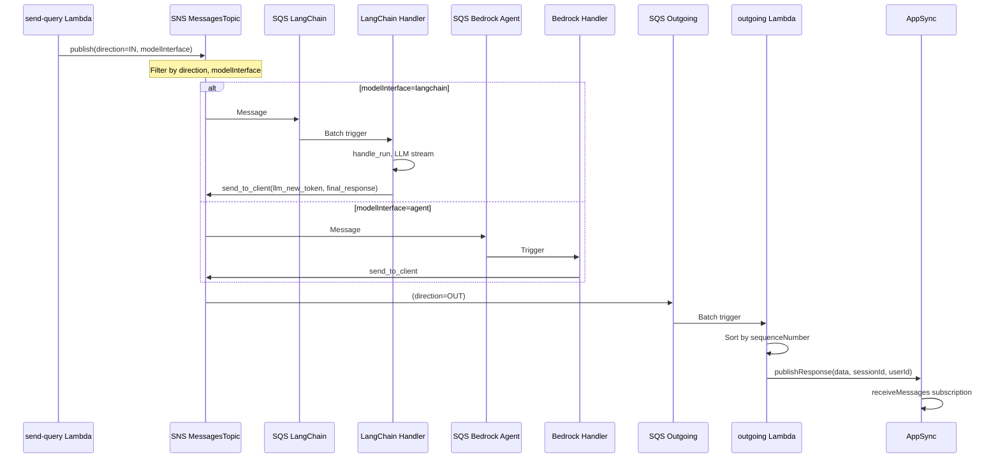

# Message Bus: SNS Messages Topic + SQS (LangChain, Agents, Idefics, WebSearch, Outgoing) — Reverse Engineering

**Scope:** SNS Messages Topic, SQS queues (LangChain, Bedrock Agents, Idefics, WebSearch, Outgoing), and the model handlers that consume/publish.  
**Evidence:** All findings cite file paths. Only code referenced from this module is included.

---

## 1. Main Classes / Files

### 1.1 CDK Infrastructure — SNS Topic & Outgoing Queue

| File | Purpose |
|------|---------|
| `lib/chatbot-api/websocket-api.ts` | RealtimeGraphqlApiBackend: creates SNS MessagesTopic (KMS, X-Ray if advanced), OutgoingMessagesQueue + DLQ (maxReceiveCount=3), SNS subscription to Outgoing with filter `direction` = OUT |
| `lib/chatbot-api/index.ts` | ChatBotApi: instantiates RealtimeGraphqlApiBackend, exports messagesTopic and queue for stack wiring |

### 1.2 CDK Infrastructure — Stack Wiring (SNS Subscriptions)

| File | Purpose |
|------|---------|
| `lib/aws-genai-llm-chatbot-stack.ts` | Adds SNS subscriptions from messagesTopic to each interface queue with filter policies; conditionally creates LangChain, WebSearch, Bedrock Agents, Idefics interfaces |

### 1.3 LangChain Interface

| File | Purpose |
|------|---------|
| `lib/model-interfaces/langchain/index.ts` | LangChainInterface: creates LangChainIngestionQueue (visibilityTimeout 90min, DLQ maxReceiveCount=3), request-handler Lambda (SQS event source), grants messagesTopic.publish; MESSAGES_TOPIC_ARN env |
| `lib/model-interfaces/langchain/functions/request-handler/index.py` | Consumes SQS (BatchProcessor), parses SNS Message body, handles action RUN/HEARTBEAT; handle_run loads session, resolves context, invokes adapter, streams via on_llm_new_token → send_to_client; final response & errors via send_to_client |
| `lib/shared/layers/python-sdk/python/genai_core/utils/websocket.py` | send_to_client(detail, topic_arn): sets direction=OUT if absent, sns.publish to MESSAGES_TOPIC_ARN |

### 1.4 Bedrock Agents Interface

| File | Purpose |
|------|---------|
| `lib/model-interfaces/bedrock-agents/index.ts` | BedrockAgentsInterface: creates IngestionQueue (visibilityTimeout 16min, DLQ maxReceiveCount=3), request-handler Lambda (batchSize=1, reportBatchItemFailures), grants messagesTopic.publish |
| `lib/model-interfaces/bedrock-agents/functions/request-handler/bedrock_agents_core.py` | handle_run: loads history, invokes Bedrock Agent, streams tokens and final response via send_to_client |

### 1.5 Idefics Interface

| File | Purpose |
|------|---------|
| `lib/model-interfaces/idefics/index.ts` | IdeficsInterface: creates IdeficsIngestionQueue (visibilityTimeout 90min, DLQ maxReceiveCount=3), request-handler Lambda (SQS event source), private API Gateway for S3 files, grants messagesTopic.publish |
| `lib/model-interfaces/idefics/functions/request-handler/index.py` | Consumes SQS, handle_run invokes Idefics adapter, streams via on_llm_new_token → send_to_client, final response via send_to_client |

### 1.6 WebSearch Interface

| File | Purpose |
|------|---------|
| `lib/model-interfaces/websearch/index.ts` | WebSearchInterface: creates WebSearchQueue (visibilityTimeout 300s), webSearchLambda (SQS event source), Secrets Manager access |
| `lib/model-interfaces/websearch/functions/websearch-handler/index.py` | handler(event): expects query, userId, sessionId; fetches Bing API key, calls Bing Search API v7, returns dict with content/sources (does not publish to SNS; standalone flow would need send_to_client) |

### 1.7 Outgoing Handler

| File | Purpose |
|------|---------|
| `lib/chatbot-api/appsync-ws.ts` | RealtimeResolvers: creates outgoing-message Lambda, adds SqsEventSource(props.queue) |
| `lib/chatbot-api/functions/outgoing-message-appsync/index.ts` | SQS batch processor: parses SNS Message, sorts by token.sequenceNumber, strips metadata for non-admin on final_response, calls publishResponse mutation via graphQlQuery |

### 1.8 Publishers

| File | Purpose |
|------|---------|
| `lib/chatbot-api/functions/resolvers/send-query-lambda-resolver/index.py` | Publishes to SNS with direction=IN, action, modelInterface, data (from sendQuery mutation) |
| `lib/shared/types.ts` | Direction { In, Out }, ModelInterface { LangChain, MultiModal } |

---

## 2. Call Relationships

```
SNS MessagesTopic
  │
  ├─ Subscription (direction=OUT) ────────────────────────→ SQS OutgoingMessagesQueue
  │                                                               → outgoing-message Lambda → AppSync publishResponse
  │
  ├─ Subscription (direction=IN, modelInterface=langchain) ─→ SQS LangChainIngestionQueue
  │                                                               → LangChain request-handler
  │                                                                   → send_to_client ──→ SNS (direction=OUT)
  │
  ├─ Subscription (direction=IN, modelInterface=multimodal) → SQS IdeficsIngestionQueue
  │                                                               → Idefics request-handler
  │                                                                   → send_to_client ──→ SNS (direction=OUT)
  │
  ├─ Subscription (modelInterface=agent) ──────────────────→ SQS BedrockAgents IngestionQueue
  │                                                               → Bedrock request-handler
  │                                                                   → send_to_client ──→ SNS (direction=OUT)
  │
  └─ Subscription (direction=IN, sourceMode=web|hybrid, modelInterface=websearch) → SQS WebSearchQueue
                                                                                       → WebSearch handler (Bing API)
                                                                                         (returns dict; no send_to_client in current code)

Publishers:
  send-query Lambda ──→ SNS (direction=IN, modelInterface, action, data)
  genai_core.utils.websocket.send_to_client ──→ SNS (direction=OUT, action, userId, data)
```

---

## 3. Inputs / Outputs

### 3.1 SNS Message (direction=IN) — from send-query

| Field | Type | Purpose |
|-------|------|---------|
| action | string | e.g. "run", "heartbeat" |
| modelInterface | string | "langchain", "multimodal", "agent", "websearch" |
| direction | string | "IN" |
| timestamp | string | Unix timestamp |
| userId | string | Cognito sub |
| userGroups | string[] | Cognito groups |
| applicationId | string? | If application flow |
| systemPrompts | object? | systemPrompt, systemPromptRag, condenseSystemPrompt |
| data | object | sessionId, workspaceId, text, mode, modelName, provider, images, documents, videos, modelKwargs, sourceMode |

### 3.2 SNS Message (direction=OUT) — from handlers via send_to_client

| Field | Type | Purpose |
|-------|------|---------|
| action | string | "llm_new_token", "final_response", "error", "heartbeat" |
| direction | string | "OUT" (added by send_to_client) |
| userId | string | — |
| timestamp | string | — |
| userGroups | string[]? | For final_response, used for metadata stripping |
| data | object | sessionId, token { runId, sequenceNumber, value } or content, metadata |

### 3.3 SQS Payload (SNS → SQS envelope)

| Structure | Format |
|-----------|--------|
| record.body | JSON string of SNS Notification |
| JSON.Message | Actual message body (must be parsed again) |
| detail | JSON.parse(Message) = the IN/OUT message object |

---

## 4. DB Tables / Collections Touched

| Component | Table | Operation |
|-----------|-------|-----------|
| LangChain request-handler | SESSIONS_TABLE_NAME | read/write (DynamoDBChatMessageHistory) |
| LangChain request-handler | APPLICATIONS_TABLE_NAME | read (get_application_provider) |
| LangChain request-handler | CONNECTORS_TABLE_NAME | read (connector_registry, when enabled) |
| LangChain request-handler | Aurora, OpenSearch, Kendra, Bedrock KB | read (RAG retrieval) |
| Bedrock request-handler | SESSIONS_TABLE_NAME | read/write (DynamoDBChatMessageHistory) |
| Idefics request-handler | SESSIONS_TABLE_NAME | read/write |
| WebSearch handler | None | — |
| Outgoing handler | None | — |
| SNS / SQS | None | — |

---

## 5. External APIs Called

| Component | Service | Method | Purpose |
|-----------|---------|--------|---------|
| send-query Lambda | SNS | publish | Publish IN message |
| genai_core.utils.websocket | SNS | publish | Publish OUT message |
| LangChain handler | Bedrock, SageMaker, Nexus | InvokeModel, InvokeEndpoint | LLM inference |
| LangChain handler | Aurora, OpenSearch, Kendra | Query/Retrieve | RAG retrieval |
| Bedrock handler | Bedrock Agent | InvokeAgent, InvokeAgentAlias | Agent inference |
| Idefics handler | SageMaker | InvokeEndpoint | Multimodal inference |
| WebSearch handler | Bing Search API | GET https://api.bing.microsoft.com/v7.0/search | Web search |
| Outgoing handler | AppSync | HTTP POST (IAM) publishResponse | Push to WebSocket |

---

## 6. Error Handling / Retry Logic

### 6.1 SQS / DLQ

| Queue | maxReceiveCount | Behavior |
|-------|------------------|----------|
| OutgoingMessagesQueue | 3 | Failed messages move to OutgoingMessagesDLQ |
| LangChainIngestionQueue | 3 | Failed messages move to LangChain DLQ |
| IdeficsIngestionQueue | 3 | Failed messages move to Idefics DLQ |
| BedrockAgents IngestionQueue | 3 | Failed messages move to IngestionDLQ |
| WebSearchQueue | (none) | No DLQ configured |

### 6.2 LangChain request-handler

| Case | Behavior | Evidence |
|------|----------|----------|
| BatchProcessingError | logger.error, handle_failed_records for fail triplet | index.py:639-649 |
| handle_failed_records | send_to_client({ action: "error", ... }) with user-friendly message | index.py:369-622 |
| ValidationException (image size) | Specific message for Nova reel / canvas | index.py:333-345 |
| AccessDeniedException (model) | "Model not enabled" message | index.py:349-356 |

### 6.3 Bedrock / Idefics handlers

| Case | Behavior |
|------|----------|
| ClientError, BotoCoreError | Log, send_to_client error |
| Generic exception | send_to_client error with sanitized message |

### 6.4 Outgoing handler

| Case | Behavior |
|------|----------|
| processPartialResponse | BatchProcessor; failed records return batchItemFailures for retry |
| graphQlQuery failure | Throws; record fails; SQS retry or DLQ |

### 6.5 Visibility timeout

| Queue | Visibility timeout | Reason |
|-------|--------------------|--------|
| LangChain | 90 min (15 × 6) | Long-running LLM + RAG |
| Idefics | 90 min | Multimodal inference |
| Bedrock Agents | 16 min | Agent invocation |
| WebSearch | 300 s | Bing API call |
| Outgoing | default | Quick AppSync publish |

---

## 7. Sequence of Execution — Main Happy Path (IN → Handler → OUT → AppSync)

1. send-query Lambda publishes to SNS: `{ direction: "IN", modelInterface: "langchain", action: "run", data: {...} }`.
2. SNS filter policies deliver:
   - direction=IN + modelInterface=langchain → LangChainIngestionQueue
   - (other filters apply to other queues as applicable)
3. LangChain request-handler Lambda triggered by SQS batch.
4. record_handler: parse `record.body` → SNS Notification → `Message` → `detail = JSON.parse(Message)`.
5. If `detail.action == "run"`: handle_run(detail).
6. handle_run: load session (DynamoDB), resolve context (RAG/connectors), get adapter, run model.
7. on_llm_new_token: `send_to_client({ action: "llm_new_token", data: { token }, ... })`; send_to_client adds direction=OUT, publishes to SNS.
8. SNS subscription direction=OUT → OutgoingMessagesQueue.
9. Outgoing Lambda triggered; sorts records by token.sequenceNumber.
10. For each record: parse SNS Message, build publishResponse mutation, graphQlQuery (AppSync).
11. AppSync publishResponse → receiveMessages subscription filter → WebSocket push to client.

---

## 8. Mermaid Sequence Diagram



---

## 9. Mermaid Component Diagram

```mermaid
flowchart TB
    subgraph SNS["SNS Messages Topic"]
        Topic[MessagesTopic]
    end

    subgraph Publishers["Publishers"]
        SQ[send-query Lambda]
        SendClient[send_to_client]
    end

    subgraph Queues["SQS Queues"]
        LCQ[LangChain IngestionQueue]
        AgentQ[Bedrock Agents IngestionQueue]
        IdeficsQ[Idefics IngestionQueue]
        WebQ[WebSearch Queue]
        OutQ[Outgoing Queue]
    end

    subgraph Handlers["Model Handlers"]
        LC[LangChain request-handler]
        Agent[Bedrock request-handler]
        Idefics[Idefics request-handler]
        Web[WebSearch handler]
        Out[outgoing Lambda]
    end

    SQ -->|direction=IN| Topic
    SendClient -->|direction=OUT| Topic

    Topic -->|direction=IN, modelInterface=langchain| LCQ
    Topic -->|modelInterface=agent| AgentQ
    Topic -->|direction=IN, modelInterface=multimodal| IdeficsQ
    Topic -->|direction=IN, sourceMode=web\|hybrid, modelInterface=websearch| WebQ
    Topic -->|direction=OUT| OutQ

    LCQ --> LC
    AgentQ --> Agent
    IdeficsQ --> Idefics
    WebQ --> Web
    OutQ --> Out

    LC --> SendClient
    Agent --> SendClient
    Idefics --> SendClient
    Out --> AppSync[AppSync publishResponse]
```

---

## 10. SNS Filter Policies Summary

| Subscription Target | Filter | Allowlist |
|---------------------|--------|-----------|
| OutgoingMessagesQueue | direction | OUT |
| LangChainIngestionQueue | direction, modelInterface | IN, langchain |
| IdeficsIngestionQueue | direction, modelInterface | IN, multimodal |
| BedrockAgents IngestionQueue | modelInterface | agent |
| WebSearchQueue | direction, sourceMode, modelInterface | IN, web \| hybrid, websearch |

**Note:** Bedrock Agents subscription filters only on modelInterface=agent (no direction). send-query sets direction=IN for agent requests, so IN messages are delivered. OUT messages from other handlers omit modelInterface, so they do not match this subscription.

---

**Evidence summary:**
- `lib/chatbot-api/websocket-api.ts`, `index.ts`
- `lib/aws-genai-llm-chatbot-stack.ts`
- `lib/model-interfaces/langchain/index.ts`, `functions/request-handler/index.py`
- `lib/model-interfaces/bedrock-agents/index.ts`, `functions/request-handler/bedrock_agents_core.py`
- `lib/model-interfaces/idefics/index.ts`, `functions/request-handler/index.py`
- `lib/model-interfaces/websearch/index.ts`, `functions/websearch-handler/index.py`
- `lib/chatbot-api/functions/outgoing-message-appsync/index.ts`
- `lib/shared/layers/python-sdk/python/genai_core/utils/websocket.py`
- `lib/shared/types.ts`
