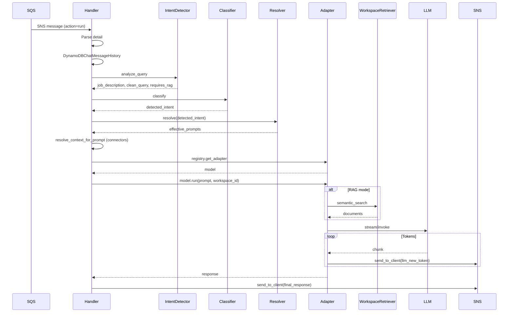
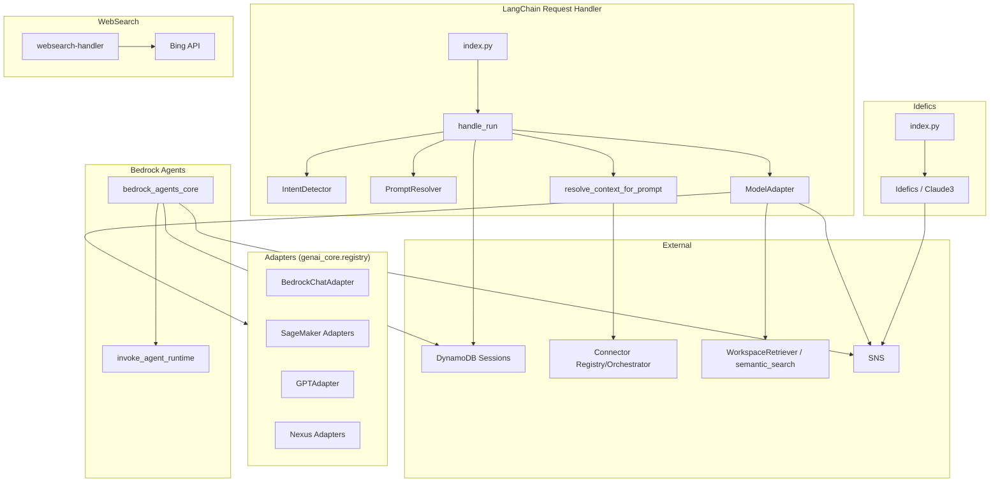

# Model Processors: LangChain, Bedrock Agents, Idefics, WebSearch Handlers — Reverse Engineering

**Scope:** `lib/model-interfaces/` (LangChain, Bedrock Agents, Idefics, WebSearch request-handlers and adapters).  
**Evidence:** All findings cite file paths. Only code referenced from this module is included.

---

## 1. Main Classes / Files

### 1.1 LangChain Interface

| File | Purpose |
|------|---------|
| `lib/model-interfaces/langchain/index.ts` | LangChainInterface CDK construct: ingestion queue, request-handler Lambda, MESSAGES_TOPIC_ARN, RAG/connector env vars |
| `lib/model-interfaces/langchain/functions/request-handler/index.py` | Handler entry: BatchProcessor, record_handler (RUN/HEARTBEAT), handle_run, handle_failed_records; imports adapters |
| `lib/model-interfaces/langchain/functions/request-handler/adapters/__init__.py` | Imports bedrock, sagemaker, openai, azureopenai, nexus, bedrock_agent (registers adapters) |
| `lib/model-interfaces/langchain/functions/request-handler/adapters/base/base.py` | ModelAdapter: run(), run_with_chain_v2(), run_with_chain(), run_with_media_generation_chain(); WorkspaceRetriever RAG; guardrails; send tokens via callback |
| `lib/model-interfaces/langchain/functions/request-handler/adapters/bedrock/__init__.py` | BedrockChatAdapter, BedrockChatNoStreamingNoSystemPromptAdapter, BedrockChatMediaGeneration registrations |
| `lib/model-interfaces/langchain/functions/request-handler/adapters/bedrock/base.py` | Bedrock adapter impl (extends ModelAdapter) |
| `lib/model-interfaces/langchain/functions/request-handler/adapters/sagemaker/**/*.py` | SageMaker adapters (Mistral, Mixtral, Llama, FalconLite) |
| `lib/model-interfaces/langchain/functions/request-handler/adapters/nexus/__init__.py` | NexusBedrockChatAdapter, NexusOpenAIChatAdapter |
| `lib/model-interfaces/langchain/functions/request-handler/adapters/openai/gpt.py` | GPTAdapter |
| `lib/model-interfaces/langchain/functions/request-handler/adapters/azureopenai/azuregpt.py` | AzureGptAdapter |
| `lib/model-interfaces/langchain/functions/request-handler/adapters/bedrock_agent/registry.py` | BedrockAgentAdapter (for modelInterface=langchain with bedrock agent model) |
| `lib/model-interfaces/langchain/functions/request-handler/adapters/shared/prompts/staffing_prompts.py` | STAFFING_PROMPTS (job_posting_creation, resume_assessment, qa_mode, general) |
| `lib/model-interfaces/langchain/functions/request-handler/utils/intent_detector.py` | IntentDetector.analyze_query(): JD extraction, clean_query, requires_rag, intent patterns |
| `lib/model-interfaces/langchain/functions/request-handler/utils/intent/__init__.py` | create_classifier → RuleClassifier or LLMClassifier |
| `lib/model-interfaces/langchain/functions/request-handler/utils/intent/factory.py` | create_classifier() based on INTENT_CLASSIFIER_ENABLED |
| `lib/model-interfaces/langchain/functions/request-handler/utils/intent/rule_classifier.py` | RuleClassifier.classify() |
| `lib/model-interfaces/langchain/functions/request-handler/utils/prompt_resolver/__init__.py` | create_resolver, IntentPromptResolver, parse_intent_prompts |
| `lib/model-interfaces/langchain/functions/request-handler/utils/prompt_resolver/factory.py` | create_resolver(intent_prompts_str, system_prompts, locale) |
| `lib/model-interfaces/langchain/functions/request-handler/utils/prompt_resolver/intent_resolver.py` | IntentPromptResolver.resolve(intent) → effective prompts |
| `lib/model-interfaces/langchain/functions/request-handler/utils/application_provider/__init__.py` | get_application_provider() → DynamoDBApplicationProvider |
| `lib/model-interfaces/langchain/functions/request-handler/utils/application_provider/dynamodb_provider.py` | DynamoDBApplicationProvider.get_application() |

### 1.2 Bedrock Agents Interface

| File | Purpose |
|------|---------|
| `lib/model-interfaces/bedrock-agents/index.ts` | BedrockAgentsInterface: IngestionQueue, request-handler Lambda (batchSize=1) |
| `lib/model-interfaces/bedrock-agents/functions/request-handler/index.py` | Handler: BatchProcessor, record_handler delegates to bedrock_agents_core |
| `lib/model-interfaces/bedrock-agents/functions/request-handler/bedrock_agents_core.py` | handle_run: validate_agent_id, get_conversation_history, invoke_agent_runtime (streaming or JSON), send_to_client tokens/final/thinking, save_session_history |

### 1.3 Idefics Interface

| File | Purpose |
|------|---------|
| `lib/model-interfaces/idefics/index.ts` | IdeficsInterface: ingestion queue, request-handler Lambda, private API Gateway for S3 files |
| `lib/model-interfaces/idefics/functions/request-handler/index.py` | Handler: BatchProcessor, record_handler, handle_run, handle_failed_records |
| `lib/model-interfaces/idefics/functions/request-handler/adapters/idefics.py` | Idefics adapter: format_prompt (images via CHATBOT_FILES_PRIVATE_API URL), SagemakerEndpoint.predict |
| `lib/model-interfaces/idefics/functions/request-handler/adapters/claude.py` | Claude3 adapter for bedrock.anthropic.claude-3.* |

### 1.4 WebSearch Interface

| File | Purpose |
|------|---------|
| `lib/model-interfaces/websearch/index.ts` | WebSearchInterface: WebSearchQueue, webSearchLambda (SQS trigger) |
| `lib/model-interfaces/websearch/functions/websearch-handler/index.py` | handler(event): expects query, userId, sessionId, topK; Bing API v7.0; returns dict (no send_to_client) |

### 1.5 Shared / genai_core

| File | Purpose |
|------|---------|
| `lib/shared/layers/python-sdk/python/genai_core/utils/websocket.py` | send_to_client(detail, topic_arn): adds direction=OUT, sns.publish |
| `lib/shared/layers/python-sdk/python/genai_core/registry/index.py` | AdapterRegistry.get_adapter(model): regex match → adapter class |
| `lib/shared/layers/python-sdk/python/genai_core/langchain/workspace_retriever.py` | WorkspaceRetriever: genai_core.semantic_search.semantic_search() |
| `lib/shared/layers/python-sdk/python/genai_core/langchain/__init__.py` | DynamoDBChatMessageHistory, WorkspaceRetriever |
| `lib/shared/layers/python-sdk/python/genai_core/clients.py` | get_bedrock_client, get_agentcore_client, get_sagemaker_client |
| `lib/shared/layers/python-sdk/python/genai_core/connectors/registry.py` | get_connectors_for_application, list_connectors |
| `lib/shared/layers/python-sdk/python/genai_core/connectors/intent.py` | detect_connector_intent |
| `lib/shared/layers/python-sdk/python/genai_core/connectors/orchestrator.py` | execute_query |

---

## 2. Call Relationships

```
SQS (SNS Message)
  │
  ├─ LangChain request-handler
  │    ├─ record_handler → handle_run(detail)
  │    │    ├─ DynamoDBChatMessageHistory(session_id, user_id)
  │    │    ├─ get_application_provider().get_application(application_id)
  │    │    ├─ IntentDetector.analyze_query(prompt, workspace_id, session_history)
  │    │    ├─ create_classifier().classify(prompt, valid_intents, context)
  │    │    ├─ create_resolver(...).resolve(detected_intent) → effective_prompts
  │    │    ├─ resolve_context_for_prompt() → connector_registry, connector_orchestrator
  │    │    ├─ registry.get_adapter(provider.model_id) → adapter class
  │    │    ├─ adapter(...) → model
  │    │    │    └─ model.run(prompt, workspace_id, images, documents, videos, system_prompts)
  │    │    │         └─ run_with_chain_v2 → WorkspaceRetriever, create_retrieval_chain
  │    │    ├─ on_llm_new_token → send_to_client(llm_new_token)
  │    │    └─ send_to_client(final_response)
  │    └─ handle_failed_records → send_to_client(error)
  │
  ├─ Bedrock Agents request-handler
  │    ├─ record_handler → handle_run(detail, context)
  │    │    ├─ validate_agent_id(agent_runtime_arn)
  │    │    ├─ get_conversation_history(session_id, user_id)
  │    │    ├─ genai_core.clients.get_agentcore_client().invoke_agent_runtime()
  │    │    ├─ send_to_client(thinking_step, llm_new_token, final_response)
  │    │    └─ save_session_history()
  │    └─ handle_heartbeat → send_to_client
  │
  ├─ Idefics request-handler
  │    ├─ record_handler → handle_run(detail)
  │    │    ├─ DynamoDBChatMessageHistory
  │    │    ├─ registry.get_adapter(provider.model_id) → Idefics/Claude3
  │    │    ├─ model.format_prompt(), model.handle_run()
  │    │    ├─ chat_history.add_user_message, add_ai_message
  │    │    └─ send_to_client(final_response)
  │    └─ handle_failed_records → send_to_client
  │
  └─ WebSearch handler
       └─ handler(event): get_bing_api_key, requests.get(Bing API) → return dict
```

---

## 3. Inputs / Outputs

### 3.1 Input (SQS Record → Parsed Detail)

| Field | Type | Purpose |
|-------|------|---------|
| action | string | "run", "heartbeat" |
| userId | string | Cognito sub |
| userGroups | string[] | Cognito groups |
| data | object | sessionId, workspaceId, text, mode, modelName, provider, images, documents, videos, modelKwargs, sourceMode, applicationId, agentRuntimeArn (agent) |

### 3.2 LangChain handle_run Output

| Output | Format |
|--------|--------|
| llm_new_token | send_to_client({ action: "llm_new_token", data: { token } }) |
| final_response | send_to_client({ action: "final_response", data: { sessionId, type, content, metadata } }) |
| error | send_to_client({ action: "error", data: { sessionId, content } }) |

### 3.3 Bedrock handle_run Output

| Output | Format |
|--------|--------|
| thinking_step | send_to_client({ action: "thinking_step", data: { content, step } }) |
| llm_new_token | send_to_client({ action: "llm_new_token", data: { token } }) |
| final_response | send_to_client({ action: "final_response", data: { content, metadata } }) |
| error | send_to_client({ action: "error", data: { content } }) |

### 3.4 WebSearch handler Output

| Output | Format |
|--------|--------|
| Success | { type: "text", action: "FINAL_RESPONSE", data: { content, sources, sessionId, userId } } |
| Error | { type: "error", message: str } |

**Note:** WebSearch returns a dict; when invoked via SQS it does not call send_to_client. For standalone web search (modelInterface=websearch), a wrapper would need to publish to SNS.

---

## 4. DB Tables / Collections Touched

| Component | Table | Operation |
|-----------|-------|-----------|
| LangChain | SESSIONS_TABLE_NAME | read/write (DynamoDBChatMessageHistory) |
| LangChain | APPLICATIONS_TABLE_NAME | read (get_application) |
| LangChain | CONNECTORS_TABLE_NAME | read (connector_registry when enabled) |
| LangChain | Aurora / OpenSearch / Kendra | read (WorkspaceRetriever → genai_core.semantic_search) |
| Bedrock Agents | SESSIONS_TABLE_NAME | read/write (DynamoDBChatMessageHistory) |
| Idefics | SESSIONS_TABLE_NAME | read/write |
| WebSearch | None | — |

---

## 5. External APIs Called

| Component | Service | Method | Purpose |
|-----------|---------|--------|---------|
| LangChain | Bedrock | InvokeModel, InvokeModelWithResponseStream, ApplyGuardrail | LLM inference, guardrails |
| LangChain | SageMaker | InvokeEndpoint | Model inference |
| LangChain | OpenAI / Azure OpenAI | (API) | When adapters used |
| LangChain | Nexus | (via genai_core.clients) | Model routing |
| LangChain | Connector Gateway | MCP / execute_query | External data (when connectors enabled) |
| Bedrock Agents | Bedrock AgentCore | invoke_agent_runtime | Agent invocation |
| Idefics | SageMaker | InvokeEndpoint | Idefics / Claude multimodal |
| Idefics | API Gateway (private) | GET /{folder}/{key} | S3 file URLs for images |
| WebSearch | Bing Search API | GET https://api.bing.microsoft.com/v7.0/search | Web search |
| All | SNS | publish (send_to_client) | Push response to Outgoing queue |

---

## 6. Error Handling / Retry Logic

### 6.1 LangChain

| Case | Behavior | Evidence |
|------|----------|----------|
| BatchProcessingError | logger.error, handle_failed_records | index.py:639-649 |
| ValidationException (image 1280x720) | Specific message | index.py:333-335 |
| ValidationException (image width 320-4096) | Specific message | index.py:336-341 |
| AccessDeniedException (model) | "Model not enabled" | index.py:349-356 |
| Other | Generic "Something went wrong" | index.py:606 |
| Retry | SQS DLQ after 3 failures | LangChain index.ts |

### 6.2 Bedrock Agents

| Case | Behavior | Evidence |
|------|----------|----------|
| ValueError (invalid agent ID) | "Invalid request parameters" | bedrock_agents_core.py:399-417 |
| JSONDecodeError | "Unable to process response" | bedrock_agents_core.py:375-396 |
| ClientError, BotoCoreError | "Service temporarily unavailable" | bedrock_agents_core.py:418-437 |
| Exception | "An unexpected error occurred" | bedrock_agents_core.py:438-461 |

### 6.3 Idefics

| Case | Behavior |
|------|----------|
| ValidationException (image size) | Specific Nova reel/canvas message |
| AccessDeniedException | "Model not enabled" |
| Other | "Something went wrong" |

### 6.4 WebSearch

| Case | Behavior |
|------|----------|
| Missing query | return { type: "error", message: "Missing query" } |
| requests exception | return { type: "error", message: str(e) } |
| Timeout | 10s on requests.get |

### 6.5 Adapter Registry

| Case | Behavior |
|------|----------|
| No matching adapter | ValueError("Adapter for model X not found") |

---

## 7. Sequence of Execution — Main Happy Path (LangChain)

1. SQS delivers SNS message; record_handler parses body → Message → detail.
2. detail.action == "run" → handle_run(detail).
3. Extract: user_id, user_groups, data (provider, model_id, prompt, session_id, workspace_id, images, documents, videos, system_prompts, application_id).
4. DynamoDBChatMessageHistory(session_id, user_id) → session_history.
5. If application_id: get_application_provider().get_application() → intent_prompts_str, valid_intents.
6. IntentDetector.analyze_query(prompt, workspace_id, session_history) → job_description, clean_query, requires_rag.
7. create_classifier().classify(prompt, valid_intents, context) → detected_intent.
8. create_resolver(intent_prompts_str, system_prompts, locale).resolve(detected_intent) → effective_prompts; merge with system_prompts.
9. Context: if job_posting_creation+JD → STAFFING_PROMPTS template; elif resume_assessment → processed_prompt; else resolve_context_for_prompt (connectors) → context_block, build_augmented_prompt.
10. registry.get_adapter(provider.model_id) → adapter class.
11. adapter(on_llm_new_token=...) → model.
12. use_workspace_for_rag = workspace_id and (requires_rag or intent in general/qa_mode/resume_assessment).
13. model.run(prompt_for_model, workspace_id, images, documents, videos, system_prompts):
    - run_with_chain_v2: WorkspaceRetriever(workspace_id), create_history_aware_retriever, create_retrieval_chain, stream/invoke.
    - on_llm_new_token → send_to_client(llm_new_token).
14. send_to_client(final_response) with connector_sources, connector_citations in metadata.

---

## 8. Mermaid Sequence Diagram



---

## 9. Mermaid Component Diagram



---

## 10. Adapter Registry Patterns

| Provider | Regex | Adapter |
|----------|-------|---------|
| bedrock.anthropic.claude* | ^bedrock.anthropic.claude* | BedrockChatAdapter |
| bedrock.meta.llama* | ^bedrock.meta.llama* | BedrockChatAdapter |
| bedrock.amazon.nova* | ^bedrock.amazon.nova* | BedrockChatAdapter |
| bedrock.amazon.titan-* | ^bedrock.amazon.titan-t* | BedrockChatNoSystemPromptAdapter |
| sagemaker.amazon-FalconLite* | (?i)sagemaker.amazon-FalconLite* | SMFalconLiteAdapter |
| sagemaker.mistralai-Mistral* | (?i)sagemaker.mistralai-Mistral* | SMMistralInstructAdapter |
| sagemaker.*idefics* | ^sagemaker.*idefics* | Idefics |
| bedrock.anthropic.claude-3.* | ^bedrock.anthropic.claude-3.* | Claude3 |
| openai.* | ^openai..* | GPTAdapter |
| nexus.bedrock* | ^nexus.bedrock* | NexusChatAdapter |
| nexus.openai* | ^nexus.openai* | NexusOpenAIChatAdapter |

---

**Evidence summary:**
- `lib/model-interfaces/langchain/functions/request-handler/index.py`, `adapters/**`
- `lib/model-interfaces/langchain/functions/request-handler/utils/intent_detector.py`, `intent/`, `prompt_resolver/`, `application_provider/`
- `lib/model-interfaces/bedrock-agents/functions/request-handler/index.py`, `bedrock_agents_core.py`
- `lib/model-interfaces/idefics/functions/request-handler/index.py`, `adapters/idefics.py`
- `lib/model-interfaces/websearch/functions/websearch-handler/index.py`
- `lib/shared/layers/python-sdk/python/genai_core/` (registry, utils.websocket, langchain, clients, connectors)
