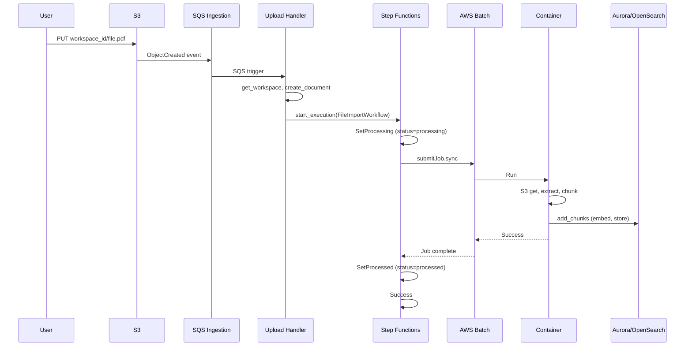
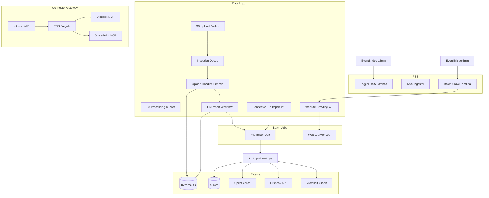

# RAG & Data Import, Step Functions, Batch Jobs, Upload Handler, Connector Gateway — Reverse Engineering

**Scope:** `lib/rag-engines/`, `lib/connectors/connector-gateway/`, and related data-import workflows.  
**Evidence:** All findings cite file paths. Only code referenced from this module is included.

---

## 1. Main Classes / Files

### 1.1 Data Import & Orchestration

| File | Purpose |
|------|---------|
| `lib/rag-engines/data-import/index.ts` | DataImport: creates uploadBucket, processingBucket, ingestionQueue (S3 events), FileImportBatchJob, FileImportWorkflow, ConnectorFileImportWorkflow (if connectorsTable), WebCrawlerBatchJob, WebsiteCrawlingWorkflow, RssSubscription, UploadHandler Lambda |
| `lib/rag-engines/index.ts` | RagEngines: RagDynamoDBTables, DataImport, Workspaces (delete workflows); exports fileImportWorkflow, connectorFileImportWorkflow, websiteCrawlingWorkflow, deleteWorkspaceWorkflow, deleteDocumentWorkflow |

### 1.2 Upload Handler

| File | Purpose |
|------|---------|
| `lib/rag-engines/data-import/functions/upload-handler/index.py` | SQS-triggered Lambda: parses S3 event (ObjectCreated only), extracts workspace_id from key, get_workspace, create_document; Kendra: copy to Kendra bucket + metadata; else: start FileImportWorkflow Step Function |

### 1.3 Step Functions

| File | Purpose |
|------|---------|
| `lib/rag-engines/data-import/file-import-workflow.ts` | FileImportWorkflow: SetProcessing → Batch submitJob.sync (FileImportBatchJob) → SetProcessed → Success |
| `lib/rag-engines/data-import/website-crawling-workflow.ts` | WebsiteCrawlingWorkflow: SetProcessing → Batch submitJob.sync (WebCrawlerBatchJob) → SetProcessed; addCatch HandleError (status=error, Fail) |
| `lib/rag-engines/data-import/connector-file-import-workflow.ts` | ConnectorFileImportWorkflow: SetProcessing → Batch submitJob (CONNECTOR_ID, FILE_PATH env) → SetProcessed |
| `lib/rag-engines/aurora-pgvector/create-aurora-workspace.ts` | CreateAuroraWorkspace: SetCreating → Lambda (create) → SetReady → Success; addCatch HandleError |
| `lib/rag-engines/workspaces/delete-workspace.ts` | DeleteWorkspace: Lambda delete (Aurora, OpenSearch, Kendra, S3, DynamoDB cleanup) |
| `lib/rag-engines/workspaces/delete-document.ts` | DeleteDocument: Lambda delete (Aurora, OpenSearch, Kendra, S3, DynamoDB cleanup) |

### 1.4 Batch Jobs

| File | Purpose |
|------|---------|
| `lib/rag-engines/data-import/file-import-batch-job.ts` | FileImportBatchJob: Fargate JobQueue, EcsJobDefinition (lib/shared file-import-dockerfile), env WORKSPACE_ID, DOCUMENT_ID, INPUT_*, PROCESSING_*, CONNECTOR_ID, FILE_PATH; retryAttempts=3 |
| `lib/rag-engines/data-import/web-crawler-batch-job.ts` | WebCrawlerBatchJob: Fargate JobQueue, EcsJobDefinition (web-crawler-dockerfile) |
| `lib/shared/file-import-batch-job/main.py` | File import entry: get_workspace, get_document; if CONNECTOR_ID: connector_files.fetch_file_content → put S3; else S3FileLoader/extract; genai_core.chunks.split_content, add_chunks |
| `lib/shared/web-crawler-batch-job/index.py` | Web crawler entry: get S3 object (JSON: workspace, document, priority_queue, etc.), genai_core.websites.crawler.crawl_urls |

### 1.5 RSS Subscription

| File | Purpose |
|------|---------|
| `lib/rag-engines/data-import/rss-subscription.ts` | RssSubscription: rssIngestorFunction (invoked per workspace/document), triggerRssIngestorsFunction (EventBridge 15 min → ingest_rss_feeds), crawlQueuedRssPostsFunction (EventBridge 5 min → batch_crawl_websites, start WebsiteCrawlingWorkflow) |
| `lib/rag-engines/data-import/functions/rss-ingestor/index.py` | check_rss_feed_for_posts(workspace_id, document_id) |
| `lib/rag-engines/data-import/functions/trigger-rss-ingestors/index.py` | genai_core.documents.ingest_rss_feeds() |
| `lib/rag-engines/data-import/functions/batch-crawl-rss-posts/index.py` | genai_core.documents.batch_crawl_websites() |

### 1.6 Connector Gateway

| File | Purpose |
|------|---------|
| `lib/connectors/connector-gateway/index.ts` | ConnectorGateway: ECS Cluster, internal ALB, path-based listener rules (/sharepoint/*, /dropbox/*); Fargate services per connector type (SharePoint placeholder Python image, Dropbox from dropbox-mcp-server); health check /health |
| `lib/connectors/dropbox-mcp-server/` | Dropbox MCP server Docker image (when dropboxEnabled) |

### 1.7 Connector File Import (API → Workflow)

| File | Purpose |
|------|---------|
| `lib/chatbot-api/functions/api-handler/routes/connectors.py` | ingestFromConnector: create_document_for_connector, start_connector_file_import_workflow per file |
| `lib/shared/layers/python-sdk/python/genai_core/documents.py` | create_document_for_connector, start_connector_file_import_workflow (Step Function startExecution) |
| `lib/shared/layers/python-sdk/python/genai_core/connectors/connector_files.py` | fetch_file_content: connector_registry.get_connector; Dropbox: content API; SharePoint: Microsoft Graph; list_folder for listConnectorFolder |

### 1.8 Create Aurora Workspace

| File | Purpose |
|------|---------|
| `lib/rag-engines/aurora-pgvector/functions/create-workflow/create/index.py` | get_workspace, genai_core.aurora.create.create_workspace_table |

---

## 2. Call Relationships

```
S3 Upload (ObjectCreated)
  → ingestionQueue (SQS)
    → UploadHandler Lambda
      → genai_core.workspaces.get_workspace
      → genai_core.documents.create_document
      → [Kendra: copy to Kendra bucket, set_status processed]
      → [Else: sfn.start_execution(FileImportWorkflow)]

FileImportWorkflow
  → DynamoDB SetProcessing (status=processing)
  → Batch submitJob.sync (FileImportBatchJob: INPUT_BUCKET, INPUT_OBJECT_KEY, WORKSPACE_ID, DOCUMENT_ID)
  → DynamoDB SetProcessed (status=processed)
  → Success

FileImportBatchJob (Fargate)
  → main.py: workspace, document; if CONNECTOR_ID: connector_files.fetch_file_content → S3 put; else S3FileLoader; chunks.split_content, chunks.add_chunks

ingestFromConnector (GraphQL)
  → api-handler/routes/connectors.ingest_from_connector
    → genai_core.documents.create_document_for_connector
    → genai_core.documents.start_connector_file_import_workflow
      → ConnectorFileImportWorkflow Step Function

ConnectorFileImportWorkflow
  → SetProcessing → Batch (CONNECTOR_ID, FILE_PATH) → SetProcessed

EventBridge 15 min → triggerRssIngestorsFunction → ingest_rss_feeds
EventBridge 5 min → crawlQueuedRssPostsFunction → batch_crawl_websites → start WebsiteCrawlingWorkflow
rssIngestorFunction (invoked) → check_rss_feed_for_posts

WebsiteCrawlingWorkflow
  → SetProcessing → Batch submitJob (WebCrawlerBatchJob: bucket_name, object_key from crawl payload)
  → SetProcessed [addCatch HandleError]

CreateAuroraWorkspace
  → SetCreating → Lambda create (create_workspace_table) → SetReady
```

---

## 3. Inputs / Outputs

### 3.1 Upload Handler

| Input | Source | Format |
|-------|--------|--------|
| SQS body | S3 event notification | { Records: [ { eventName, s3: { bucket, object } } ] } |
| object_key | S3 key | workspace_id/file_name |

| Output | Action |
|--------|--------|
| Kendra | copy_object to Kendra bucket, put_object metadata, set_status processed |
| Aurora/OpenSearch | start_execution FileImportWorkflow with workspace_id, document_id, input_bucket, input_object_key, processing_bucket, processing_object_key |

### 3.2 File Import Workflow

| Input | Format |
|-------|--------|
| workspace_id, document_id | string |
| input_bucket_name, input_object_key | S3 location |
| processing_bucket_name, processing_object_key | S3 output |

### 3.3 Connector File Import Workflow

| Input | Format |
|-------|--------|
| workspace_id, document_id, connector_id, file_path | string |
| processing_bucket_name, processing_object_key | S3 output |

### 3.4 ingestFromConnector

| Input | Format |
|-------|--------|
| workspaceId, connectorId, filePaths | IngestFromConnectorInput |

| Output | Format |
|--------|--------|
| documentIds, errors | IngestFromConnectorResult |

---

## 4. DB Tables / Collections Touched

| Component | Table | Operation |
|-----------|-------|-----------|
| Upload Handler | WORKSPACES_TABLE | read (get_workspace) |
| Upload Handler | DOCUMENTS_TABLE | write (create_document) |
| Upload Handler | DOCUMENTS_TABLE | update (set_status for Kendra) |
| File Import Workflow | DOCUMENTS_TABLE | update (status processing/processed) |
| Website Crawling Workflow | DOCUMENTS_TABLE | update (status processing/processed/error) |
| Connector File Import Workflow | DOCUMENTS_TABLE | update |
| File Import Batch Job | WORKSPACES_TABLE, DOCUMENTS_TABLE | read |
| File Import Batch Job | Aurora / OpenSearch | write (add_chunks → embeddings) |
| RSS Ingestor | WORKSPACES_TABLE, DOCUMENTS_TABLE | read/write |
| Create Aurora Workspace | WORKSPACES_TABLE | read/write |
| Create Aurora Workspace | Aurora | create table |
| Delete Workspace/Document | WORKSPACES_TABLE, DOCUMENTS_TABLE, Aurora, OpenSearch, Kendra, S3 | delete |
| Connector File Import | CONNECTORS_TABLE | read (connector_registry) |

---

## 5. External APIs Called

| Component | Service | Method | Purpose |
|-----------|---------|--------|---------|
| Upload Handler | S3 | copy_object, put_object | Kendra data source |
| Upload Handler | Step Functions | start_execution | FileImportWorkflow |
| File Import Batch | S3 | get_object, put_object | Read source, write extracted content |
| File Import Batch | genai_core.chunks | split_content, add_chunks | Chunking, embeddings, Aurora/OpenSearch |
| File Import Batch (connector) | Dropbox API | files/download | fetch_file_content |
| File Import Batch (connector) | Microsoft Graph | drives/.../content | fetch_file_content |
| Web Crawler Batch | S3 | get_object | Crawl manifest JSON |
| Web Crawler Batch | genai_core.websites.crawler | crawl_urls | HTTP fetch, extract |
| Connector Gateway | ECS Fargate, ALB | — | Hosts MCP servers (query-time, not file import) |
| connector_files | Dropbox API, Microsoft Graph | list_folder, download | Direct API (no gateway for file import) |
| Create Aurora Workspace | Aurora | SQL create table | Workspace schema |
| Delete Workspace/Document | Aurora, OpenSearch, Kendra, S3 | Delete operations | Cleanup |

---

## 6. Error Handling / Retry Logic

### 6.1 Upload Handler

| Case | Behavior | Evidence |
|------|----------|----------|
| Workspace not found | raise CommonError | upload-handler index.py:52-53 |
| Skipped event | ObjectRemoved etc. → skip (process_record filters ObjectCreated only) | get_records_from_sqs_record |
| SQS DLQ | maxReceiveCount: 3 | data-import index.ts:78-79 |

### 6.2 Step Functions

| Workflow | Error handling |
|----------|----------------|
| FileImportWorkflow | No explicit catch; Batch job retryAttempts=3 |
| WebsiteCrawlingWorkflow | addCatch(handleError): DynamoDB status=error, Fail |
| ConnectorFileImportWorkflow | No explicit catch |
| CreateAuroraWorkspace | addCatch(handleError): status=error, Fail |

### 6.3 Batch Jobs

| Job | Retry | Strategies |
|-----|-------|------------|
| FileImportBatchJob | retryAttempts: 3 | CANNOT_PULL_CONTAINER, exit 137 |
| WebCrawlerBatchJob | retryAttempts: 3 | Same |
| File import main.py | On exception: set_status error, raise | main.py:82-86 |

### 6.4 Connector File Import

| Case | Behavior |
|------|----------|
| ingest_from_connector | try/except per file, errors list |
| fetch_file_content | CommonError for Dropbox/SharePoint failures |
| connector_files | 401 → token expired message; 400 → Bad Request detail |

---

## 7. Sequence of Execution — Main Happy Path (File Upload)

1. User uploads file to S3 uploadBucket at key `workspace_id/file_name`.
2. S3 ObjectCreated event → ingestionQueue (SQS).
3. UploadHandler Lambda triggered by SQS.
4. get_records_from_sqs_record: filter ObjectCreated only.
5. process_record: parse bucket, key, size; workspace_id = key_split[0].
6. genai_core.workspaces.get_workspace(workspace_id); raise if not found.
7. genai_core.documents.create_document(workspace_id, document_type="file", path, title, size).
8. If engine==kendra: copy to Kendra bucket, put metadata, set_status processed.
9. Else: sfn.start_execution(FileImportWorkflow, input: workspace_id, document_id, input_bucket, input_object_key, processing_bucket, processing_object_key).
10. FileImportWorkflow: SetProcessing (status=processing) → Batch submitJob sync → SetProcessed (status=processed) → Success.
11. File Import Batch container: get_workspace, get_document; S3FileLoader or connector fetch; extract content; chunks.split_content, chunks.add_chunks (embed → Aurora/OpenSearch).
12. Document status = processed; chunks stored in RAG engine.

---

## 8. Mermaid Sequence Diagram



---

## 9. Mermaid Component Diagram



---

## 10. Connector File Import vs Connector Gateway

| Use Case | Path | Gateway? |
|----------|------|----------|
| **File import** (ingestFromConnector, Batch job) | connector_files.fetch_file_content → Dropbox API / Microsoft Graph directly | No — direct API from Batch container |
| **Query-time context** (LangChain resolve_context_for_prompt) | connector_orchestrator.execute_query → mcp_client.MCPClient → Connector Gateway HTTP | Yes — MCP servers behind ALB |

The Connector Gateway hosts MCP servers for **query-time** connector execution. File import uses **direct Dropbox/Microsoft Graph APIs** via connector_files (Secrets Manager for credentials).

---

**Evidence summary:**
- `lib/rag-engines/data-import/index.ts`, `file-import-workflow.ts`, `website-crawling-workflow.ts`, `connector-file-import-workflow.ts`, `rss-subscription.ts`
- `lib/rag-engines/data-import/file-import-batch-job.ts`, `web-crawler-batch-job.ts`
- `lib/rag-engines/data-import/functions/upload-handler/index.py`, `rss-ingestor/index.py`, `trigger-rss-ingestors/index.py`, `batch-crawl-rss-posts/index.py`
- `lib/shared/file-import-batch-job/main.py`, `web-crawler-batch-job/index.py`
- `lib/rag-engines/aurora-pgvector/create-aurora-workspace.ts`
- `lib/rag-engines/workspaces/delete-workspace.ts`, `delete-document.ts`
- `lib/connectors/connector-gateway/index.ts`
- `lib/chatbot-api/functions/api-handler/routes/connectors.py`
- `lib/shared/layers/python-sdk/python/genai_core/documents.py`, `connectors/connector_files.py`
