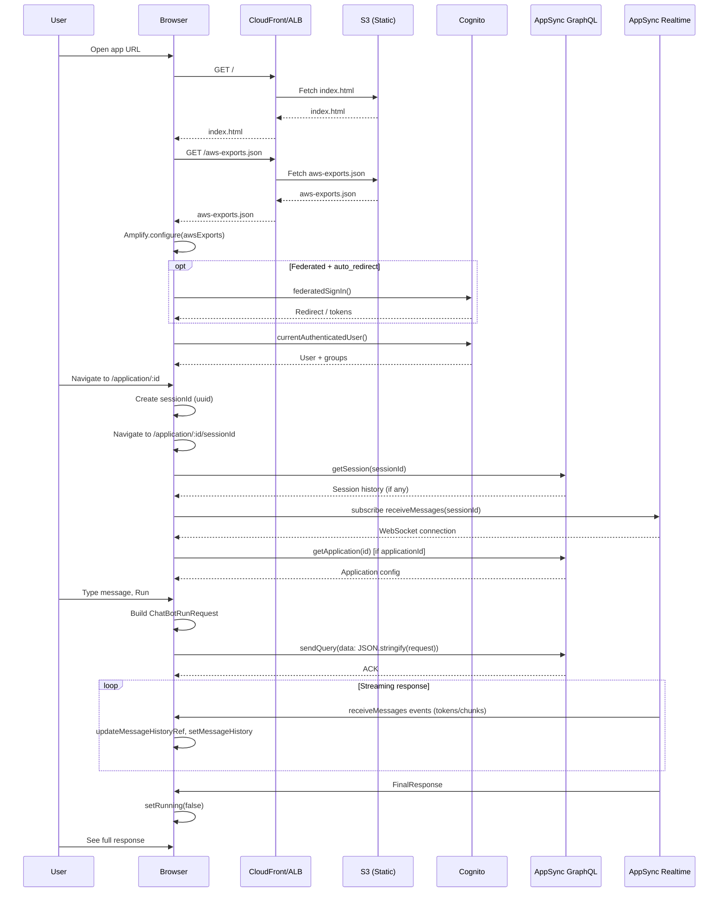
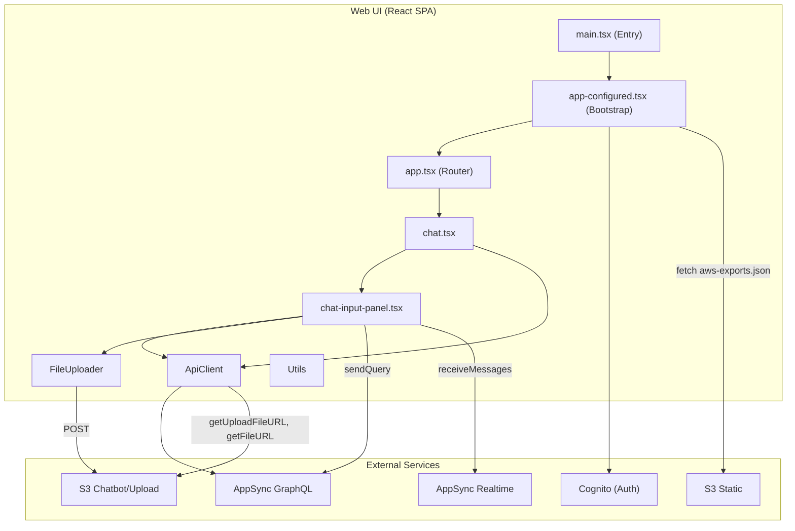

# Web UI (React SPA) / CloudFront / ALB — Reverse Engineering

**Scope:** `lib/user-interface/` (CDK constructs) and `lib/user-interface/react-app/` (React SPA).  
**Evidence:** All findings cite file paths. Only code referenced from this module is included.

---

## 1. Main Classes / Files

### 1.1 CDK Infrastructure (Deployment)

| File | Purpose |
|------|---------|
| `lib/user-interface/index.ts` | UserInterface construct: builds React app, deploys to S3, writes aws-exports.json, chooses PublicWebsite or PrivateWebsite |
| `lib/user-interface/public-website.ts` | PublicWebsite: CloudFront distribution, S3 origin (OAI), CSP headers, 404→index.html for SPA routing, geo restriction |
| `lib/user-interface/private-website.ts` | PrivateWebsite: internal ALB, targets S3 via VPC endpoint (IP targets), HTTPS listener, /→index.html redirect |
| `lib/user-interface/react-app/vite.config.ts` | Vite config; dev server port 3000; aws-exports.json write in dev |
| `lib/user-interface/react-app/package.json` | Build script: `tsc && vite build`; deps: aws-amplify, react, cloudscape, react-router-dom |

### 1.2 React SPA — Entry & Bootstrap

| File | Purpose |
|------|---------|
| `lib/user-interface/react-app/index.html` | HTML shell; loads `src/main.tsx` |
| `lib/user-interface/react-app/src/main.tsx` | Entry: StorageHelper.getTheme(), StorageHelper.applyTheme(), render AppConfigured |
| `lib/user-interface/react-app/src/components/app-configured.tsx` | Fetches `/aws-exports.json`, Amplify.configure(), optional federated redirect, Auth.currentAuthenticatedUser() for roles; wraps App in Authenticator + ThemeProvider + AppContext + UserContext |
| `lib/user-interface/react-app/src/common/app-context.ts` | AppContext React context for AppConfig |
| `lib/user-interface/react-app/src/common/types.ts` | AppConfig, UserRole, LoadingStatus, etc. |

### 1.3 React SPA — Routing & Layout

| File | Purpose |
|------|---------|
| `lib/user-interface/react-app/src/app.tsx` | Router (BrowserRouter or HashRouter if privateWebsite); routes for /application/:id, /chatbot/*, /rag/*, /admin/*; role-based route visibility (ADMIN, WORKSPACE_MANAGER) |
| `lib/user-interface/react-app/src/layout.tsx` | Layout wrapper: optional GlobalHeader + children |

### 1.4 React SPA — API Layer

| File | Purpose |
|------|---------|
| `lib/user-interface/react-app/src/common/api-client/api-client.ts` | ApiClient facade: lazy-instantiated sub-clients (health, ragEngines, embeddings, crossEncoders, models, agents, workspaces, sessions, semanticSearch, documents, kendra, bedrockKB, userFeedback, roles, applications, connectors) |
| `lib/user-interface/react-app/src/common/api-client/sessions-client.ts` | SessionsClient: getSessions, getSession, deleteSession, deleteSessions, getFileUploadSignedUrl, getFileSignedUrl via GraphQL |
| `lib/user-interface/react-app/src/common/api-client/documents-client.ts` | DocumentsClient: presignedFileUploadPost, getDocuments, getDocumentDetails, addTextDocument, addQnADocument, addWebsite, addRssFeed, etc. |
| `lib/user-interface/react-app/src/common/api-client/workspaces-client.ts` | WorkspacesClient: listWorkspaces, getWorkspace, createAuroraWorkspace, etc. |
| `lib/user-interface/react-app/src/common/api-client/applications-client.ts` | ApplicationsClient: listApplications, getApplication, createApplication, updateApplication, deleteApplication |
| `lib/user-interface/react-app/src/common/api-client/connectors-client.ts` | ConnectorsClient: listConnectors, getConnector, createConnector, etc. |
| `lib/user-interface/react-app/src/API.ts` | Auto-generated GraphQL types (queries, mutations, subscriptions) |
| `lib/user-interface/react-app/src/graphql/queries.ts` | GraphQL query strings |
| `lib/user-interface/react-app/src/graphql/mutations.ts` | GraphQL mutation strings |
| `lib/user-interface/react-app/src/graphql/subscriptions.ts` | receiveMessages subscription |

### 1.5 React SPA — Chat / Realtime

| File | Purpose |
|------|---------|
| `lib/user-interface/react-app/src/components/chatbot/chat.tsx` | Chat: session state, message history, loads session via ApiClient.sessions.getSession, delegates to ChatInputPanel |
| `lib/user-interface/react-app/src/components/chatbot/chat-input-panel.tsx` | ChatInputPanel: subscribe to receiveMessages, send sendQuery mutation; model/workspace/application loading; run handler |
| `lib/user-interface/react-app/src/components/chatbot/chat-message.tsx` | ChatMessage: renders message; fetches file signed URLs for images/videos/documents; retry loop for async files |
| `lib/user-interface/react-app/src/components/chatbot/file-dialog.tsx` | FileDialog: upload files via getUploadFileURL + FileUploader to S3 |
| `lib/user-interface/react-app/src/common/file-uploader.ts` | FileUploader: POST to presigned S3 URL via FormData |
| `lib/user-interface/react-app/src/pages/application/application.tsx` | ApplicationChat: creates sessionId via uuid, passes to Chat |
| `lib/user-interface/react-app/src/pages/chatbot/playground/playground.tsx` | Playground: Chat wrapper for /chatbot/playground |

### 1.6 React SPA — RAG / Admin Pages

| File | Purpose |
|------|---------|
| `lib/user-interface/react-app/src/pages/rag/add-data/add-data.tsx` | AddData: workspace selector, tabs for file upload, text, QnA, website, RSS, connector |
| `lib/user-interface/react-app/src/pages/rag/add-data/data-file-upload.tsx` | DataFileUpload: get presigned URL via documents.presignedFileUploadPost, upload via FileUploader |
| `lib/user-interface/react-app/src/pages/rag/workspaces/workspaces-table.tsx` | WorkspacesTable: listWorkspaces, deleteWorkspace |
| `lib/user-interface/react-app/src/pages/admin/connectors/connectors.tsx` | Connectors: listConnectors, createConnector, testConnector, deleteConnector |
| `lib/user-interface/react-app/src/pages/admin/applications/application-table.tsx` | ApplicationTable: listApplications |
| `lib/user-interface/react-app/src/pages/admin/manage-application/application-form.tsx` | ApplicationForm: getApplication, createApplication, updateApplication |

### 1.7 React SPA — Helpers

| File | Purpose |
|------|---------|
| `lib/user-interface/react-app/src/common/utils.ts` | Utils.getErrorMessage() for 429 and error.errors; generateUUID, etc. |
| `lib/user-interface/react-app/src/common/helpers/storage-helper.ts` | StorageHelper: localStorage for theme, selected model, selected workspace, navigation panel state |
| `lib/user-interface/react-app/src/common/user-context.ts` | UserContext: userRoles, userEmail |

---

## 2. Call Relationships

```
main.tsx
  └─ AppConfigured
       ├─ fetch(/aws-exports.json)
       ├─ Amplify.configure(awsExports)
       ├─ Auth.currentAuthenticatedUser() [optional federated]
       ├─ Auth.federatedSignIn() [optional]
       └─ App (inside Authenticator)
            └─ Routes
                 ├─ ApplicationChat → Chat
                 ├─ Playground → Chat
                 ├─ AddData, Workspaces, CreateWorkspace, etc.
                 └─ Applications, ManageApplication, Connectors

Chat
  ├─ ApiClient(appContext).sessions.getSession(sessionId)
  └─ ChatInputPanel
       ├─ API.graphql({ query: receiveMessages, variables: { sessionId } }).subscribe()
       ├─ API.graphql({ query: sendQuery, variables: { data } })
       ├─ ApiClient.models.listModels(), agents.listAgents(), workspaces.getWorkspaces()
       └─ ApiClient.applications.getApplication(applicationId) [when applicationId]

ChatInputPanel → FileDialog → ApiClient.documents.presignedFileUploadPost() + FileUploader.upload()
ChatMessage → ApiClient.sessions.getFileSignedUrl(fileName)
DataFileUpload → ApiClient.documents.presignedFileUploadPost() + FileUploader.upload()
```

**API client usage (all via ApiClient + AppContext):**

- `API.graphql()` from aws-amplify for sendQuery, receiveMessages
- ApiClient sub-clients call `API.graphql()` with queries/mutations from graphql/*.ts

---

## 3. Inputs / Outputs

### 3.1 Config Input (aws-exports.json)

**Source:** Injected at deploy by `lib/user-interface/index.ts` (exportsAsset).

| Key | Purpose |
|-----|---------|
| aws_project_region, aws_cognito_region | AWS region |
| aws_user_pools_id, aws_user_pools_web_client_id | Cognito User Pool |
| Auth, oauth | Amplify auth config |
| aws_appsync_graphqlEndpoint | AppSync GraphQL URL |
| aws_appsync_authenticationType | AMAZON_COGNITO_USER_POOLS |
| config.rag_enabled, connectors_enabled, etc. | Feature flags |

### 3.2 User Inputs (from UI)

- **Auth:** Email/password or federated sign-in (OIDC/SAML via Cognito)
- **Chat:** Text prompt, optional images/documents/videos, model, workspace, configuration
- **RAG:** Workspace selection, file uploads, text/QnA/website/RSS/connector inputs
- **Admin:** Application CRUD, connector CRUD

### 3.3 Outputs (to User)

- **Chat:** Message history (human + AI), streaming tokens, file URLs for attachments
- **RAG:** Workspace list, document list, semantic search results
- **Admin:** Application list, connector list, CRUD feedback

---

## 4. DB Tables / Collections Touched

The React SPA does **not** access databases directly. All persistence is via AppSync GraphQL, which resolves to Lambda and backend services. The SPA effectively interacts with these logical entities through the API:

| Logical Entity | Backend Storage | SPA Access |
|----------------|-----------------|------------|
| Sessions | DynamoDB Sessions | getSession, listSessions, deleteSession via GraphQL |
| Applications | DynamoDB Applications | getApplication, listApplications, create/update/deleteApplication |
| Workspaces | DynamoDB Workspaces | listWorkspaces, getWorkspace, create*Workspace |
| Documents | DynamoDB Documents | listDocuments, getDocument, add*Document, deleteDocument |
| Connectors | DynamoDB Connectors | listConnectors, getConnector, create/update/deleteConnector |
| User feedback | S3 User Feedback | addUserFeedback |

---

## 5. External APIs Called

| Service | Method | Purpose | File(s) |
|---------|--------|---------|---------|
| **AWS Cognito** | Auth.* (Amplify) | Sign-in, federated sign-in, currentAuthenticatedUser | app-configured.tsx |
| **AWS AppSync (GraphQL)** | API.graphql() | All queries, mutations, subscriptions | api-client sub-clients, chat-input-panel.tsx |
| **AWS AppSync (Realtime)** | Subscription over WebSocket | receiveMessages | chat-input-panel.tsx, multi-chat.tsx |
| **S3** | POST to presigned URL | File upload (RAG, chat attachments) | file-uploader.ts, data-file-upload.tsx, file-dialog.tsx |
| **S3** | GET via presigned URL | File download (chat attachments) | chat-message.tsx (getFileSignedUrl → opens URL) |

**CSP in public-website.ts allows:**

- `connect-src`: self, cognito-idp, cognito federation domain, AppSync realtime URL, AppSync graphql URL, chatbot files bucket, upload bucket
- `img-src`: self, file bucket URLs, blob
- `media-src`: self, file bucket URLs, blob

---

## 6. Error Handling / Retry Logic

### 6.1 Error Handling

| Location | Pattern | Evidence |
|----------|---------|----------|
| `common/utils.ts` | `Utils.getErrorMessage(error)` | Detects 429 (WAF throttling) → "Too many requests. Please try again later."; otherwise `error.errors.map(e => e.message).join(", ")` | `lib/user-interface/react-app/src/common/utils.ts:83-97` |
| `app-configured.tsx` | fetch aws-exports.json failure | setError(true), render Alert "Configuration error" | `lib/user-interface/react-app/src/components/app-configured.tsx:105-106, 157-166` |
| `chat-input-panel.tsx` | sendQuery failure | catch → setRunning(false), set error message in last AI message, `Utils.getErrorMessage(err)` | `lib/user-interface/react-app/src/components/chatbot/chat-input-panel.tsx:523-531, 633-641` |
| `chat-input-panel.tsx` | receiveMessages subscription | `error: (error) => console.warn(error)` | `lib/user-interface/react-app/src/components/chatbot/chat-input-panel.tsx:184` |
| `data-file-upload.tsx` | presigned URL / upload failure | try/catch, setGlobalError(Utils.getErrorMessage(error)) | `lib/user-interface/react-app/src/pages/rag/add-data/data-file-upload.tsx:116-144` |
| Various pages | API call failures | try/catch, console.error(Utils.getErrorMessage(error)), setGlobalError or similar | application-form, manage-application, connectors, workspace, documents-tab, etc. |

### 6.2 Retry Logic

| Location | Behavior | Evidence |
|----------|----------|----------|
| `chat-message.tsx` | Retry loop for async file signed URLs (e.g. video processing) | `retryDelay=30000`, `maxRetries=12`, while loop with setTimeout | `lib/user-interface/react-app/src/components/chatbot/chat-message.tsx:131-181` |
| Amplify / AppSync | No explicit retry in SPA code | AWS Amplify handles retries internally |

---

## 7. Sequence of Execution — Main Happy Path (Chat)

1. User opens app → `main.tsx` → `AppConfigured` loads
2. `fetch("/aws-exports.json")` → `Amplify.configure(awsExports)`
3. Optional: `Auth.federatedSignIn()` if auto_redirect and not authenticated
4. `Auth.currentAuthenticatedUser()` → set userRoles, userEmail
5. `Authenticator` wraps `App`; user signs in if not authenticated
6. `App` renders; router shows route (e.g. `/application/:applicationId`)
7. `ApplicationChat` creates `sessionId` (uuid), redirects to `/application/:id/:sessionId`
8. `Chat` mounts with `sessionId`, `applicationId`
9. `Chat` calls `apiClient.sessions.getSession(sessionId)` to load history (optional)
10. `ChatInputPanel` mounts
11. `ChatInputPanel` subscribes: `API.graphql({ query: receiveMessages, variables: { sessionId } }).subscribe(...)`
12. `ChatInputPanel` loads models, agents, workspaces (or application) via ApiClient
13. User types message and runs
14. `ChatInputPanel` builds `ChatBotRunRequest`, appends human + placeholder AI messages
15. `API.graphql({ query: sendQuery, variables: { data: JSON.stringify(request) } })`
16. Backend processes → publishes to SNS → model handlers → publish response → SQS → Outgoing Handler → publishResponse
17. `receiveMessages` subscription delivers chunks → `updateMessageHistoryRef` updates tokens/content
18. On `FinalResponse` or `Error`, `setRunning(false)`
19. User sees full response in UI

---

## 8. Mermaid Sequence Diagram



---

## 9. Mermaid Component Diagram



---

## 10. CloudFront / ALB Flow

| Mode | Component | Request path |
|------|-----------|--------------|
| **Public** | CloudFront | User → CloudFront → S3 (OAI) for static assets; 404 → /index.html |
| **Private** | ALB | User (VPC) → ALB (HTTPS) → S3 VPC endpoint (IP targets) |

CloudFront does **not** proxy API traffic. The SPA calls AppSync and Cognito endpoints directly using URLs from `aws-exports.json`. CSP in `public-website.ts` allows those origins.

---

**Evidence summary:**

- `lib/user-interface/index.ts`
- `lib/user-interface/public-website.ts`
- `lib/user-interface/private-website.ts`
- `lib/user-interface/react-app/src/main.tsx`
- `lib/user-interface/react-app/src/components/app-configured.tsx`
- `lib/user-interface/react-app/src/app.tsx`
- `lib/user-interface/react-app/src/common/api-client/api-client.ts`
- `lib/user-interface/react-app/src/common/api-client/sessions-client.ts`
- `lib/user-interface/react-app/src/common/api-client/documents-client.ts`
- `lib/user-interface/react-app/src/common/file-uploader.ts`
- `lib/user-interface/react-app/src/common/utils.ts`
- `lib/user-interface/react-app/src/components/chatbot/chat.tsx`
- `lib/user-interface/react-app/src/components/chatbot/chat-input-panel.tsx`
- `lib/user-interface/react-app/src/components/chatbot/chat-message.tsx`
- `lib/user-interface/react-app/src/graphql/mutations.ts`, `subscriptions.ts`
- `lib/user-interface/react-app/src/API.ts`
